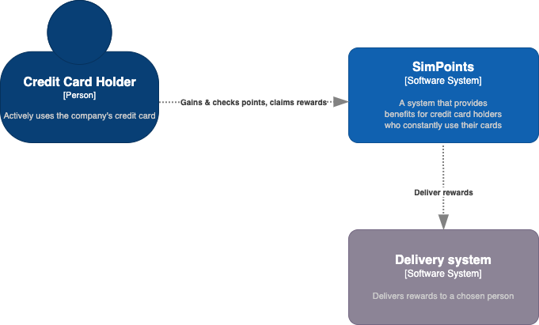

# simpoints

A simple API for exchanging points into rewards



For more in-depth diagrams & context, please check out [the docs](docs/README.md)

## Up & Running

### System dependencies

In order to run this project, you'll need the following setup in your local environment:

- Ruby 2.7.4(Via [rbenv](https://github.com/rbenv/rbenv#installation) is recommended)
- [Rails 6.1.4](https://guides.rubyonrails.org/v6.0/getting_started.html#creating-a-new-rails-project-installing-rails)
- [Postgres 13](https://www.postgresql.org/download/)

### Project dependencies

Make sure you've got all dependencies installed locally by running:

```shell script
bundle install
```

### Database

Make sure you've got a working [Postgres](https://www.postgresql.org/) instance on your env and then run:

```shell script
rails db:create
rails db:migrate
```

### Running the server

Boot a local instance of the application by running:

```shell script
rails s
```

The server is now available at `http://localhost:3000`

### Running tests

Boot a local instance of the application by running:

```shell script
rails test
```
